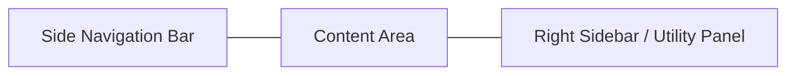

# NanoLink Desktop UI & Interaction Design

## Visual Design Concepts

*Desktop Main Command Center concept with Master-Detail layout.*

*Desktop multi-tasking view with integrated terminal and multi-agent tabs.*

## Server Connection & Navigation

### 1. Seamless Pairing
- **Short-Code Pairing**: Since desktops may lack high-quality cameras, a "6-digit pairing code" shown on the web dashboard can be used for instant connection.
- **Multi-Server Sidebar**: A dedicated server switcher panel in the top-left corner allows switching environments with one click (e.g., "Home Lab", "Edge Node Group", "Cloud Cluster").

### 2. Navigation Bar (Sidebar)
The **Left Sidebar** is the primary navigation hub.
- **Adaptive Width**: Expands on hover or stays open/closed based on user preference.
- **Status Badges**: Each navigation item can show dynamic badges (e.g., number of offline agents next to "Agents").
- **Drag-to-Order**: Navigation items can be re-ordered by the user.

## Layout Structure

The interface follows a classic **Master-Detail** layout with a persistent navigational sidebar.

### 1. Navigation Sidebar (Left)
- **Top Section**: Server Selector (dropdown + server status).
- **Middle Section**: Navigation links:
    - **Dashboard**: Global server health and alerts.
    - **All Agents**: Searchable, filterable list of all connected agents.
    - **Agent Groups**: User-defined folders for logical grouping.
    - **MCP AI**: Intelligent insights and automation control.
- **Bottom Section**: Settings and User Profile.
- **State**: Collapsible to icon-only mode to maximize workspace.

### 2. Main content Area
- **Dynamic Tabs**: Users can open multiple agents in tabs (similar to a browser).
- **Dashboard Grid**: Customizable widgets (Drag-and-Drop) for core metrics, logs, and server health.
- **Multi-Monitor Support**: Ability to detach tabs into separate windows.

### 3. Integrated Terminal (Bottom/Right)
- **Docked Mode**: A persistent terminal drawer at the bottom of the screen.
- **Split View**: Run multiple terminal sessions side-by-side.
- **Theme Sync**: Automatically match terminal colors with the app's theme.

## Key Screens

### 1. Unified Dashboard
- **Top Row**: Cumulative stats cards (Total CPUs, Total Memory, Total Disk, Network Traffic).
- **Middle Row**: High-priority alerts list and a "Top Consuming Agents" table.
- **Bottom Row**: Historical growth charts for server-wide resource consumption.

### 2. Advanced Agent List
- **Table View**: Sortable columns for Status, Hostname, OS, CPU%, Mem%, Net speed, etc.
- **Batch Actions**: Select multiple agents to perform bulk updates or configuration changes.
- **Quick Preview**: Hovering over an agent row shows a popover with live sparkline charts.

### 3. Detail & Multi-Tasking
- **Sidebars**: Collapsible right sidebar for detailed system info and user sessions without leaving the overview.
- **Context Menu**: Rich context menu (Right-click) for all agent-related actions (Shell, Restart, Edit, Delete).

## Interactions & Productivity
- **Global Search (Ctrl+K / Cmd+K)**: Instant search for agents, settings, or terminal commands.
- **Keyboard Shortcuts**:
    - `1-9`: Switch between top tabs.
    - `Ctrl + \`: Toggle integrated terminal.
    - `Ctrl + F`: Search agents.
- **Drag and Drop**: Reorder agents, move agents between groups, and rearrange dashboard widgets.

## Visual Enhancements
- **Extended Glassmorphism**: Use larger blur areas and more pronounced glass reflections for the large desktop surface.
- **Acrylic Effects**: Adapt to native OS effects (Windows 11 Mica/Acrylic, macOS Vibrancy).
- **Animations**: Subtle slide-in panels and layout transitions.
