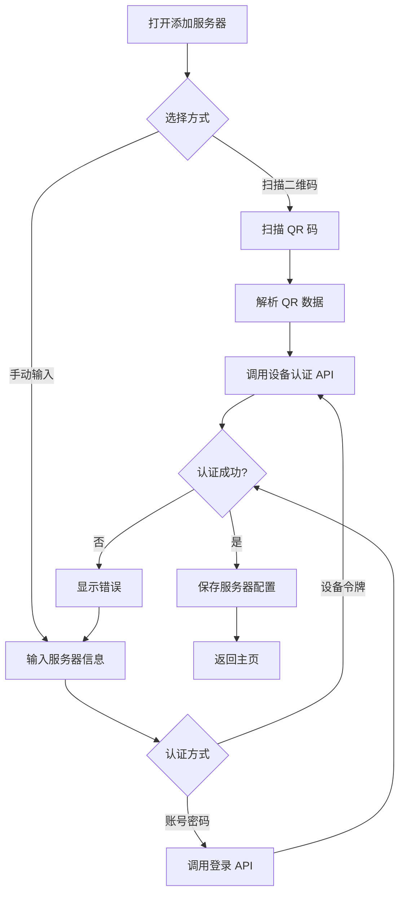

# NanoLink 设备配对与令牌管理系统设计

## 1. 概述

本文档描述了 NanoLink 移动端/桌面端通过扫描二维码或输入配对码连接服务器的功能设计，以及服务器端的设备令牌管理系统。

### 1.1 核心目标
- **便捷配对**：通过扫描 QR 码一键添加服务器，免去手动输入 URL/Token
- **安全隔离**：设备令牌与用户密码分离，令牌仅限只读权限
- **设备管理**：服务器端可查看、管理（修改权限/删除）所有已配对设备
- **多服务器支持**：客户端可同时连接多个服务器

---

## 2. 认证体系设计

### 2.1 两种认证模式

| 模式 | 认证方式 | 权限级别 | 使用场景 |
|-----|---------|---------|---------|
| **用户认证** | 用户名 + 密码 | 完整权限 (可配置 0-3) | Web 控制台、需要写操作的客户端 |
| **设备认证** | 设备令牌 (Device Token) | 只读 (PermissionLevel=0) | 扫码配对的移动/桌面端 |

### 2.2 设备令牌特性
- **唯一性**：每次生成的令牌不同，使用 UUID v4
- **可撤销**：服务端可随时禁用/删除令牌
- **只读默认**：新令牌默认只读，管理员可提升权限
- **设备绑定**：记录设备名称、类型、IP 地址等信息

---

## 3. 数据模型设计

### 3.1 新增表：`device_tokens`

```sql
CREATE TABLE device_tokens (
    id              INTEGER PRIMARY KEY AUTOINCREMENT,
    token           VARCHAR(64) UNIQUE NOT NULL,     -- UUID v4 令牌
    device_name     VARCHAR(100),                    -- 设备名称 (如 "iPhone 15")
    device_type     VARCHAR(20),                     -- 设备类型: mobile/desktop/tablet
    device_os       VARCHAR(50),                     -- 操作系统: iOS/Android/macOS/Windows/Linux
    permission_level INTEGER DEFAULT 0,              -- 权限级别: 0=只读
    is_active       BOOLEAN DEFAULT TRUE,            -- 是否启用
    last_used_at    TIMESTAMP,                       -- 最后使用时间
    last_ip         VARCHAR(50),                     -- 最后使用 IP
    created_by      INTEGER NOT NULL,                -- 创建者 (用户 ID)
    created_at      TIMESTAMP DEFAULT CURRENT_TIMESTAMP,
    updated_at      TIMESTAMP,
    deleted_at      TIMESTAMP,                       -- 软删除
    FOREIGN KEY (created_by) REFERENCES users(id)
);
```

### 3.2 GORM Model

```go
// DeviceToken represents a device authentication token
type DeviceToken struct {
    ID              uint           `gorm:"primarykey" json:"id"`
    Token           string         `gorm:"uniqueIndex;size:64;not null" json:"-"`
    DeviceName      string         `gorm:"size:100" json:"deviceName"`
    DeviceType      string         `gorm:"size:20" json:"deviceType"`  // mobile/desktop/tablet
    DeviceOS        string         `gorm:"size:50" json:"deviceOs"`    // iOS/Android/macOS/Windows/Linux
    PermissionLevel int            `gorm:"default:0" json:"permissionLevel"`
    IsActive        bool           `gorm:"default:true" json:"isActive"`
    LastUsedAt      *time.Time     `json:"lastUsedAt"`
    LastIP          string         `gorm:"size:50" json:"lastIp"`
    CreatedBy       uint           `gorm:"index;not null" json:"createdBy"`
    CreatedAt       time.Time      `json:"createdAt"`
    UpdatedAt       time.Time      `json:"updatedAt"`
    DeletedAt       gorm.DeletedAt `gorm:"index" json:"-"`
    
    // Relations
    Creator User `gorm:"foreignKey:CreatedBy" json:"creator,omitempty"`
}
```

---

## 4. API 设计

### 4.1 服务器端 API

#### 生成设备令牌 (需登录)
```
POST /api/devices/token
Response: { token, qrCode (base64), expiresIn }
```

#### 获取设备列表 (需登录)
```
GET /api/devices
Response: [{ id, deviceName, deviceType, deviceOs, permissionLevel, isActive, lastUsedAt, lastIp, createdAt }]
```

#### 更新设备权限 (需超级管理员)
```
PATCH /api/devices/:id
Body: { permissionLevel?, isActive?, deviceName? }
```

#### 删除设备 (需登录)
```
DELETE /api/devices/:id
```

### 4.2 客户端 API

#### 设备令牌认证
```
POST /api/auth/device
Headers: X-Device-Token: <token>
Body: { deviceName, deviceType, deviceOs }
Response: { success, serverInfo }
```

#### 账号密码认证 (已有)
```
POST /api/auth/login
Body: { username, password }
Response: { token, user }
```

---

## 5. 二维码内容设计

### 5.1 QR 码数据格式

```json
{
  "v": 1,                                    // 协议版本
  "s": "https://192.168.1.100:8080",        // 服务器 URL
  "t": "abc123-device-token-uuid",          // 设备令牌
  "n": "Home Server",                       // 服务器名称 (可选)
  "e": 1705600000                           // 令牌过期时间戳 (可选)
}
```

### 5.2 安全考虑
- QR 码内容使用 Base64 编码
- 令牌有效期可配置（默认永不过期，可设置 24h/7d/30d）
- 建议使用 HTTPS

---

## 6. 客户端实现

### 6.1 添加服务器流程



### 6.2 原生客户端更新

#### 新增页面/组件
- Android 与 Apple 客户端提供二维码扫描页面
- macOS 客户端提供配对码输入界面
- 添加服务器界面支持账号密码登录

#### 数据模型更新
- `ServerConnection` 保存 ID、名称、地址、用户名和认证模式
- 设备令牌与用户令牌写入平台安全存储
- 权限级别随连接信息保存，用于控制客户端操作

---

## 7. Web 控制台 UI

### 7.1 设备管理页面 (`/admin/devices`)

#### 功能列表
1. **设备列表表格**
   - 设备名称、类型、操作系统
   - 权限级别 (带颜色标识)
   - 在线状态、最后活跃时间
   - 创建时间、创建者

2. **操作按钮**
   - 生成新令牌 (显示 QR 码 + 6 位配对码)
   - 编辑设备 (修改名称、权限)
   - 禁用/启用设备
   - 删除设备

3. **生成令牌弹窗**
   - 显示 QR 码图片
   - 显示 6 位数字配对码 (60 秒有效)
   - "复制链接" 按钮
   - 倒计时过期提示

---

## 8. 实现优先级

### Phase 1: 基础设施 (必须)
- [ ] `DeviceToken` 数据模型
- [ ] 设备令牌 CRUD API
- [ ] 设备认证中间件
- [ ] QR 码生成逻辑

### Phase 2: Web 管理界面
- [ ] 设备列表页面
- [ ] 生成令牌弹窗 (含 QR 码)
- [ ] 设备编辑/删除功能

### Phase 3: 客户端实现
- [ ] Android 与 Apple 原生 QR 扫描
- [ ] macOS 配对码输入
- [ ] 账号密码登录表单
- [ ] 多认证模式支持

### Phase 4: 增强功能
- [ ] 令牌过期策略
- [ ] 设备活动日志
- [ ] 批量管理功能

---

## 9. 安全注意事项

1. **令牌存储**：客户端使用 Keychain/Keystore 安全存储令牌
2. **传输安全**：强制 HTTPS，QR 码不包含敏感信息明文
3. **权限隔离**：设备令牌默认只读，无法执行危险操作
4. **审计日志**：记录所有设备认证和权限变更
5. **速率限制**：防止令牌暴力破解
