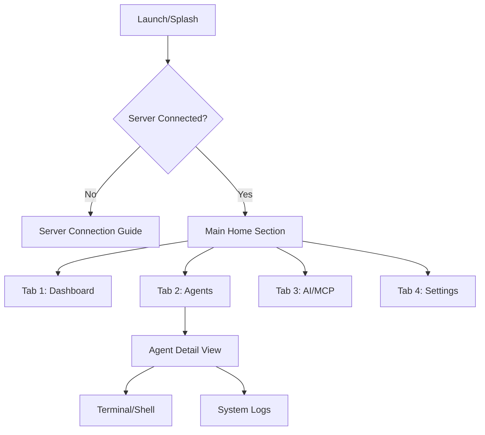

# NanoLink Mobile UI & Interaction Design

## Design Philosophy
The NanoLink mobile application follows the **"Liquid Glass"** design system, emphasizing depth, transparency, and fluidity. It is designed for high-efficiency monitoring and quick remote management.

## Visual Design Concepts

*Mobile Dashboard concept with Liquid Glass aesthetic.*

*Mobile Agent Detail concept showing real-time resource charts.*

*Add Server screen with integrated QR code scanner for seamless pairing.*

## Connection & Onboarding

### 1. "Add Server" Experience
- **QR Code Pairing**: Users can connect instantly by scanning a QR code generated in the Web Dashboard (Admin > Profile > Mobile Access). The QR code contains the Server URL and an encrypted temporal token.
- **Manual Entry**: Support for manual `http/https` URL and `JWT Token` entry for advanced setups.
- **Auto-Discovery**: Optional mDNS/Bonjour scanning for servers on the local network.

### 2. Navigation Structure
The app utilizes a persistent **Bottom Navigation Bar** that remains visible across top-level screens. 
- **Liquid Glass Bar**: Semi-transparent background with a subtle glow at the top edge.
- **Haptic Interaction**: Each tab press provides a distinct "pop" haptic feel.
- **State Preservation**: Switching tabs preserves the scroll position and state of the previous screen.

## Core Navigation Flow

The app uses a fixed **Bottom Navigation Bar** for primary top-level navigation.

## Screen Definitions

### 1. Dashboard (Home)
- **Top Bar**: Search icon, active server status indicator, and user profile button.
- **Server Selector**: A horizontal scrolling list of connected servers (chips).
- **System Health Overview**: A large glass card showing aggregate CPU/Memory usage across all agents.
- **Recent Activity/Alerts**: A list of the latest 3-5 critical alerts (e.g., "Agent X went offline").

### 2. Agents (List View)
- **Layout**: Switchable between Grid (Compact) and List (Detailed).
- **Interactions**:
    - **Swipe Right**: Quick access to "Terminal".
    - **Swipe Left**: Quick access to "Reboot" or "Stop Agent".
    - **Pull to Refresh**: Re-trigger background metrics sync.
- **Card Design**: Shows hostname, OS icon, online status, and a mini sparkline chart for CPU.

### 3. Agent Detail View
- **Header**: Dynamic background color based on agent OS. Sticky header with hostname and connectivity mode (WS/HTTP).
- **Liquid Cards**: Individual sections for CPU, Memory, Disk, GPU, and NPU.
- **Charts**: Interactive line charts for historical resource usage (tap to expand).
- **Action Floating Button**: Primary action FAB to open the Remote Terminal.

### 4. Remote Terminal (Shell)
- **Keyboard**: Custom accessory row for `Ctrl`, `Alt`, `Tab`, `Esc`, and arrow keys.
- **Visuals**: Dark glass background, glowing green/white text.
- **Session Management**: Ability to keep terminal sessions active in the background.

## Interactions & Animations
- **Spring Physics**: Use spring animations for all transitions and card expansions.
- **Haptic Feedback**: Subtle haptics on successful connections or critical alerts.
- **Parallax Effects**: Subtle parallax scrolling in the Agent Detail view.
- **Native Bridges**: Use native iOS sheet presentation controllers for menus and detail overlays.

## Multi-Platform Considerations
- **iOS**: Adhere to iOS 26 standards, native sheets, and SF Symbols.
- **Android**: Material 3 adaptations while maintaining the Glass aesthetic.
